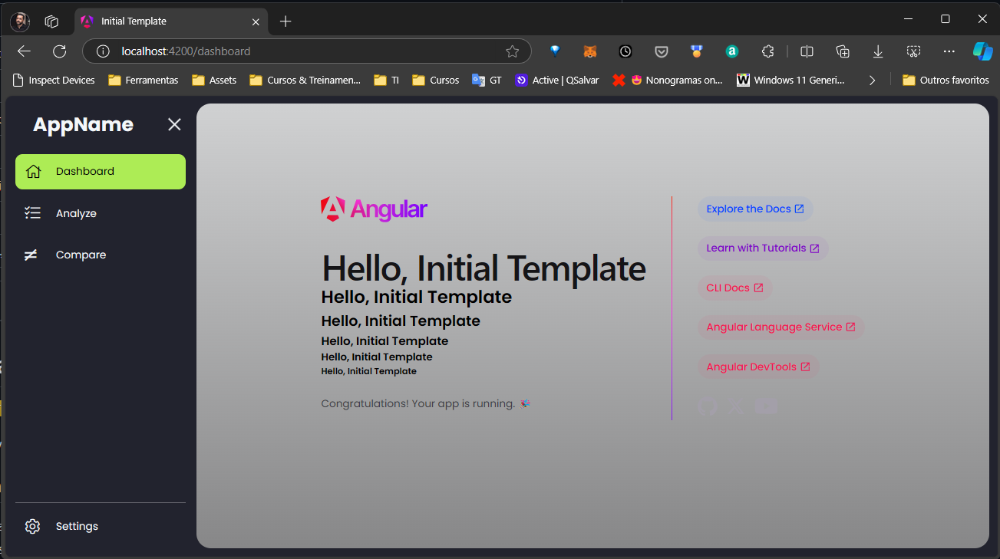

# Angular Initial Template

This project was generated with [Angular CLI](https://github.com/angular/angular-cli) version 17.3.9.

## This template contains (WIP)

- [x] Using standalone components
- [x] Using scss stylesheet.
- [x] Added route view animation
- [x] Added lazy loading routing.
- [x] Configured ESLint and Prettier
- [x] SideNav with collapse/expand animation
- [x] Page not found (404) handling
- [ ] Global error handling
- [ ] Toggle between light/dark templates.
- [ ] Breadcrumb navigator.
- [ ] Sentry.io integration for error analysis

## Development server

Run `ng serve` for a dev server. Navigate to `http://localhost:4200/`. The application will automatically reload if you change any of the source files.

## Code scaffolding

Run `ng generate component component-name` to generate a new component. You can also use `ng generate directive|pipe|service|class|guard|interface|enum|module`.

## Build

Run `ng build` to build the project. The build artifacts will be stored in the `dist/` directory.

## Running unit tests

Run `ng test` to execute the unit tests via [Karma](https://karma-runner.github.io).

## Running end-to-end tests

Run `ng e2e` to execute the end-to-end tests via a platform of your choice. To use this command, you need to first add a package that implements end-to-end testing capabilities.

## Further help

To get more help on the Angular CLI use `ng help` or go check out the [Angular CLI Overview and Command Reference](https://angular.io/cli) page.
